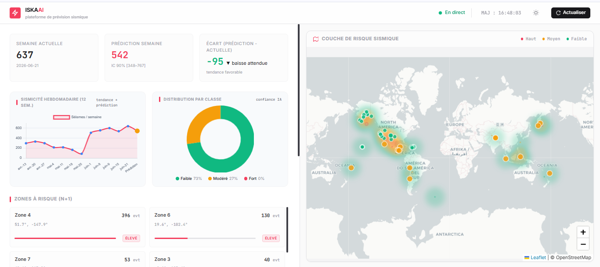
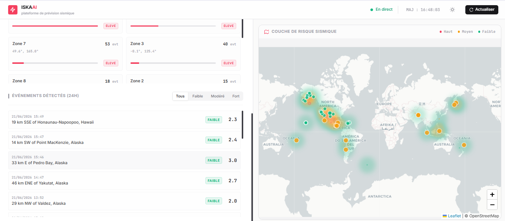

# 🌍 Plateforme Intelligente de Surveillance et de Prévision Sismique

---

## 📌 Contexte du Projet

| Intitulé | Détails |
|----------|---------|
| **Module** | Machine Learning – Projet de Fin de Module |
| **Réalisé par** | **ZAAFA Khadija** & **Aldiebes Ghanem Israa** |
| **Encadrée par** | **Oumaima Guendoul** |
| **Demandée par** | **El habib Benlhmar** |

---

## Présentation

Ce projet a pour objectif de développer une plateforme intelligente capable d'analyser l'activité sismique mondiale à partir des données ouvertes de l'**USGS** (United States Geological Survey).

Le système combine plusieurs techniques de **Machine Learning** afin de :

* Classifier les séismes récents selon leur niveau de magnitude.
* Prévoir le nombre de séismes attendus durant la semaine suivante.
* Identifier les zones géographiques présentant un risque sismique élevé.
* Visualiser les résultats dans un tableau de bord interactif.

---

## Source des données

Les données utilisées proviennent de l'API officielle de l'USGS.

Chaque événement sismique contient notamment :

* Magnitude
* Profondeur
* Latitude / Longitude
* Date et heure
* Informations sur les tsunamis
* Indicateurs de qualité des mesures

---

## Fonctionnalités principales

### 1. Classification des séismes
Le premier modèle prédit la classe de magnitude d’un séisme à partir de ses caractéristiques.

**Classes utilisées** :
* 🔵 Faible
* 🟡 Modéré
* 🔴 Fort

**Meilleur modèle** : **Random Forest**  
**Performance** : Accuracy 99.7 % | F1-Macro : 0.989

### 2. Prévision temporelle
Le deuxième modèle estime le nombre de séismes attendus pour la semaine suivante.

**Meilleur modèle** : **XGBoost**  
**Performance** : MAE 28.6 | MAPE 11.36 % | R² : 0.78

### 3. Prévision spatiale
Le troisième modèle identifie les zones géographiques les plus exposées aux risques sismiques.

**Méthodes utilisées** :
* K-Means Clustering
* XGBoost

### 4. Dashboard interactif
Le tableau de bord permet de visualiser :
* Les séismes récents
* Les prédictions de magnitude
* Les prévisions hebdomadaires
* Les zones à risque
* Les indicateurs d'activité sismique

---

## 📊 Aperçu du Dashboard

Voici un aperçu de l'interface utilisateur de la plateforme :




> *Les captures d'écran illustrent l'état du dashboard après une exécution complète du pipeline de prédiction.*

---

## Structure du projet

```text
PROJET_VF
│
├── backend
│   ├── main.py                     # API FastAPI + scheduler + endpoints
│   ├── run_all.py                  # Orchestre les 3 scripts de prédiction
│   ├── fetch_classification.py     # USGS 24h → Prédit la classe
│   ├── fetch_timeseries.py         # USGS semaine → Prédit nb séismes n+1
│   ├── fetch_zones.py              # USGS 7j → Identifie les zones à risque
│   └── check_weekly_diff.py        # Compare prédiction vs réalité
│
├── choix_des_models
│   ├── modele2+3.ipynb             # Entraînement XGBoost (temporel + spatial)
│   └── traitements-modèle1.ipynb   # Entraînement Random Forest (classification)
│
├── data
│   ├── output_classification.json  # Résultat classification (séismes 24h)
│   ├── output_forecast.json        # Résultat prévision hebdomadaire
│   ├── output_zones.json           # Résultat zones à risque
│   ├── pipeline_status.json        # Statut du pipeline
│   ├── training_history.csv        # Historique global des séismes
│   ├── weekly_history.csv          # Historique agrégé par semaine
│   └── zone_history.csv            # Historique agrégé par zone
│
├── frontend
│   └── index.html                  # Dashboard interactif (HTML/CSS/JS)
│
├── models
│   ├── rf_pipeline.pkl             # Random Forest (classification)
│   ├── model_xgb_global.pkl        # XGBoost (prédiction centrale)
│   ├── model_xgb_global_low.pkl    # XGBoost (borne basse)
│   ├── model_xgb_global_high.pkl   # XGBoost (borne haute)
│   ├── kmeans_zones.pkl            # KMeans clustering géographique
│   └── scaler_geo.pkl              # Scaler pour normaliser les coordonnées
│
├── screenshots                     # Dossier contenant les captures d'écran
│   ├── img1.png                    # Vue générale du dashboard
│   └── img2.png                    # Carte interactive
│
├── rapport_ML_vf.docx              # Rapport final du projet
├── README.md                       # Guide d'installation et lancement
└── requirements.txt                # Dépendances Python
```

---

## Modèles testés

| Catégorie | Modèles testés |
|-----------|----------------|
| **Classification** | Random Forest, XGBoost, Gradient Boosting, Decision Tree, KNN, Logistic Regression, SVM |
| **Prévision temporelle** | XGBoost, Random Forest, LightGBM, ARIMA, SARIMA, Holt-Winters |
| **Prévision spatiale** | K-Means, XGBoost |

---

## Résultats obtenus

### Classification

* Accuracy : 99.7 %
* F1-Macro : 0.989

### Prévision temporelle

* MAE : 28.6
* MAPE : 11.36 %
* R² : 0.78


# Installation et lancement

### 1. Cloner le projet

```bash
git clone https://github.com/khadijazaafa/projet_ML_ISKA.git
```

### 2. Créer un environnement virtuel

```bash
python -m venv venv
```

**Windows** :
```bash
venv\Scripts\activate
```

**Linux / Mac** :
```bash
source venv/bin/activate
```

### 3. Installer les dépendances

```bash
pip install -r requirements.txt
```

### 4. Lancer l'API Backend

```bash
cd backend
python main.py
```

Le serveur démarre sur : [http://localhost:8000](http://localhost:8000)

### 5. Générer les prédictions (optionnel)

Depuis le dossier `backend` :

```bash
python run_all.py
```

Les résultats sont enregistrés dans :

```text
data/output_classification.json
data/output_forecast.json
data/output_zones.json
```


---


Earthquake Monitoring and Forecasting using Machine Learning.
